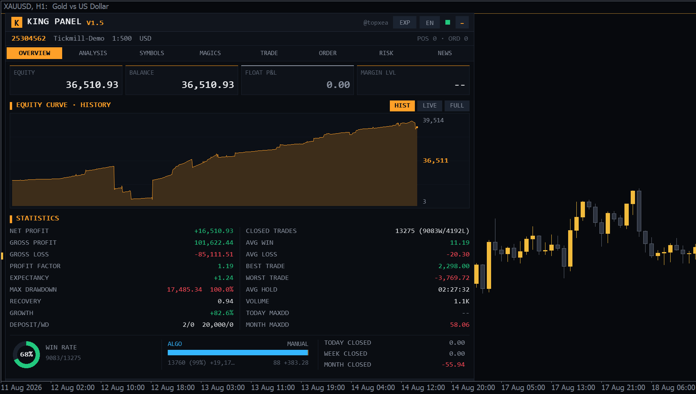
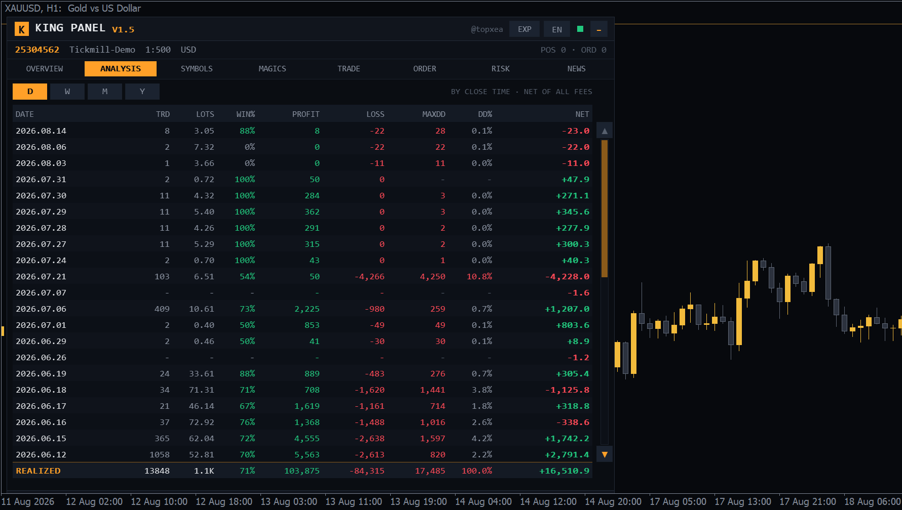
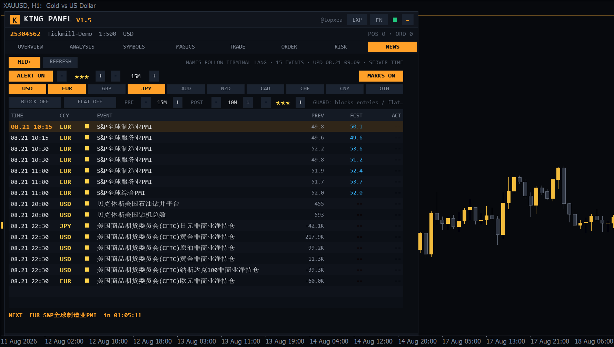
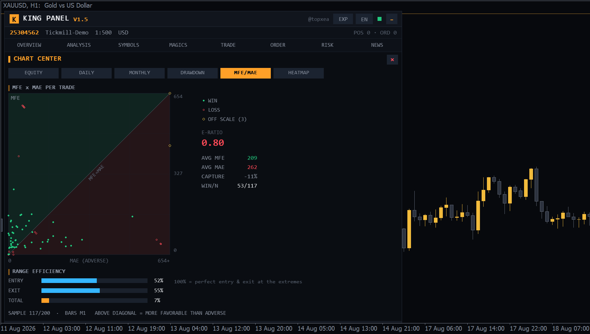

# KING PANEL V1.5

**English** | [简体中文](README.zh-CN.md)


*Overview — equity curve, 20 headline statistics, algo vs manual split.*


*Analysis — per-period table with max drawdown and DD%, sortable, D/W/M/Y.*


*News — economic calendar with star filter, currency chips, guard controls and chart marks.*


*Chart Center — MFE/MAE per trade with E-ratio and range efficiency (one of six composed pages).*

A Bloomberg-terminal style account dashboard EA for MetaTrader 5. Pure `CCanvas` bitmap rendering — near-black terminal background, amber accent, square corners, 1px separators, monospace numerics — in a compact, high-density layout. DPI-aware (auto-scales on 4K / scaled displays), draggable, collapsible, and the panel height fills the chart window.

**V1.5 highlights**: two adversarial audit rounds — **99 verified fixes** (71 findings from a six-lens code audit, then 28 regressions the fixes themselves introduced, caught by an independent verification pass): order safety (stop-level and margin pre-validation, risk guards that stay armed and retry when a close is rejected instead of silently disarming, single announcement per event), statistics (credit excluded from floating P&L, reversal deals split into closing/opening legs with a restarted entry basis, excursion cache pruned by window), **atomic single-instance ownership** (compare-and-set claim, demotion, mirror badge), crisp text on any screen (XRGB canvas + DPI-aware **InpFontScale**, CJK-aware value font). MFE/MAE sampling no longer starves: the old persisted blacklist condemned every position within seconds of attach (three retries burned by the 1 s timer while the history was still downloading, then cached for four weeks). It is now an in-memory 30 s backoff, and when M1 is genuinely unavailable — the terminal caps stored bars, or the broker will not serve it that far back — the sample degrades to M5/M15/M30/H1 and the page states which resolution it used instead of showing an empty panel forever. The session heatmap page is now self-explaining: titled axes (weekday × close hour), a legend line for cell color/number/day total/session stripes, and named market-session bands.

**V1.4 highlights**: **per-position automation** — break-even / panel-maintained trailing stop / half-close per row plus BE-ALL, TR-ALL and a trailing-distance stepper (trails only on the profitable side, never loosens, broker stop-level aware); **news guard** — entry blocking around filtered events for currency-related symbols and one-shot **auto-flat** of exposed positions before events; **Chart Center 2.0** — every page is now a composed layout with height-capped plots (no more stretched charts): equity + underwater + rolling 20-trade PF, daily bars + hold-time analysis (disposition-effect detector), monthly bars + R-multiple distribution, drawdown + streaks + three worst episodes, MFE/MAE + range-efficiency block, session heatmap + hourly-net bars; **one-click EXPORT** (positions/daily CSV + dark HTML statement with inline-SVG equity + full-chart PNG); **Telegram delivery** (event stream + daily digest via your own bot, optional); **multi-account fleet view** (all panels on the machine aggregate via the common folder); **magic aliases** ("12345=KING S1"); incremental fast-path history scan (no more 20-second full rescans on 10k+ deal accounts).

**V1.3 highlights**: **risk-% position sizing** in the order ticket (LOT/RISK modes, lots computed from equity × risk% ÷ SL distance via OrderCalcProfit, floor-rounded so realized risk never exceeds intent, live money-at-risk readout); **prop-style daily-loss guard** (realized-since-reset + floating vs a daily limit; on breach closes everything and **locks the order ticket until the next reset**, 80% budget warning, configurable reset hour, LOCKED countdown in the account strip); **native phone push** via SendNotification for every risk/lockout/news event; **session heatmap** in the Chart Center (24h × weekday P&L grid, trade counts in cells, SYD/TYO/LON/NYC bands mapped into server time, best/worst cell callout).

**V1.1–V1.2 highlights**: EN/CN bilingual UI (English default, one-click toggle in the title bar); gold chart theme (applied on load, original settings restored on removal); **order ticket** (market + four pending order types, lot/SL/TP/distance steppers, one-click execution); Chart Center with five full-size charts (equity curve, daily P&L, monthly P&L, underwater drawdown, **MFE×MAE scatter** — symmetric-scale square plot with green/red quadrant tints, E-Ratio and capture rate); pending-orders sub-page with per-row deletion; **per-period max drawdown + DD%** columns in the Analysis tab; economic calendar with **currency filter** (USD/EUR/JPY default, 10-currency chips), on-chart event lines with **lane-layout horizontal labels**, and starred popup alerts; adjustable panel width (600 px default, cent-account friendly); every panel fill is a **pre-blended opaque color** (no see-through pixels over the chart).

```
KingPanel/
├── KingPanel.mq5     Main EA (inputs, event routing, timer)
├── KP_Theme.mqh      Theme: palette / DPI scale / number & time formatting / persistence
├── KP_Canvas.mqh     Canvas layer: text, sparklines, ring gauge, bars, buttons, hit map
├── KP_Data.mqh       Statistics engine: history scan, position reconstruction,
│                     period/symbol/magic aggregation, equity curve, drawdown, MFE/MAE
├── KP_Trade.mqh      Trading ops: bulk close / order ticket / risk-guard automation
├── KP_News.mqh       Economic calendar (native MT5 Calendar API, no WebRequest needed)
├── KP_UI.mqh         Layout core: header / account strip / tabs / footer / overview / Chart Center
└── KP_UI2.mqh        Remaining tabs + click / wheel / drag interaction
```

## Install & Compile

> A compiled `KingPanel/KingPanel.ex5` is included (MetaEditor, **0 errors / 0 warnings**) and can be used directly.
> Rebuilding: `python3 compile_on_matrix.py [config]` pushes the sources to a Parallels VM, compiles with MetaEditor64 and pulls the `.ex5` back (compile only — never touches VM processes). `python3 sync_to_vm.py [config]` distributes the build. Both scripts are specific to the author's VM setup; on any Windows machine a plain MetaEditor **F7** build works the same.

1. Copy the whole `KingPanel` folder into `MQL5/Experts/` (MT5 menu File → Open Data Folder).
2. Open `KingPanel.mq5` in MetaEditor and press **F7** (all `.mqh` files live next to the main file — no extra configuration).
3. Drag the EA onto any chart. Enable **Algo Trading** if you want the close / order / risk features.
4. The News tab needs the terminal's news feed enabled (Tools → Options → Server → Enable news). Some demo environments don't serve calendar data; the panel says so explicitly.
5. **Calendar event names follow the MT5 terminal UI language** (the data comes from the terminal's built-in calendar; MQL5 offers no language parameter). For English event names switch the terminal to English via View → Languages and restart. The panel's own EN/中 toggle only affects panel text.

## Tabs

| Tab | Contents |
|---|---|
| **OVERVIEW** | Four KPI tiles (equity / balance / floating P&L / margin level); equity curve (full history ↔ live 30-minute equity, FULL opens the Chart Center); 18 core statistics; win-rate ring gauge; algo-vs-manual split bar; today / week / month P&L |
| **Chart Center** | Six composed pages (all plots height-capped): ① equity curve + underwater strip + **rolling 20-trade profit factor** ② daily bars + **hold-time analysis** with the winners/losers hold ratio ③ monthly bars + **R-multiple distribution** (SL-based, MAE proxy on small samples) ④ drawdown + **streaks** (current/max, last-10 dots) + three worst episodes with dates ⑤ **MFE×MAE scatter** (quadrant tints, E-Ratio, capture) + **range efficiency** (entry/exit/total) ⑥ **session heatmap** + hourly-net bars |
| **ANALYSIS** | Aggregated by day / week / month / year: trades, lots, win rate, gross profit, gross loss, **max drawdown + DD%** (intra-period realized-equity peak-to-trough; DD% = drawdown ÷ balance at the peak), net; full-history TOTAL row pinned at the bottom |
| **SYMBOLS** | Per-symbol aggregation + profit distribution bars; click the NET header to flip sort order |
| **MAGICS** | Per-magic-number aggregation; magic 0 shows as MANUAL |
| **TRADE** | Long/short exposure summary; six bulk operations; POS / ORD / **ACCOUNTS** sub-pages — positions rows carry **B** (break-even) / **T** (trailing toggle) / **½** (half-close) / × buttons with a BE-ALL / TR-ALL / trailing-distance toolbar; pending order list with per-row delete; ACCOUNTS aggregates every panel instance on the machine (equity/float/day P&L/lockout state, stale detection) |
| **ORDER** | Symbol cycling through Market Watch, live bid/ask/spread, **LOT / RISK-% sizing modes** (risk presets 0.25/0.5/1/2%, computed lots + money-at-risk readout, refuses when SL unset or risk exceeds the remaining day budget), lot stepper + four quick presets, SL/TP/pending-distance steppers (points), large SELL/BUY buttons and B-LMT / S-LMT / B-STP / S-STP pending buttons — all **one-click execution**, pending prices auto-respect the broker's stops level; configurable magic (default 0 = counted as manual) |
| **RISK** | Readout strip (float / day P&L / remaining day budget / positions); four one-shot guards (float-loss, float-profit, equity floor, timed close) plus the **DAILY LOSS lockout guard** (always-armed daily; toggling OFF clears an active lockout; arming while already beyond the limit locks orders without touching positions) |
| **NEWS** | Native MT5 economic calendar (server timezone); importance filter; **trade guard row** (BLOCK = refuse new orders around filtered events touching the symbol's currencies, FLAT = one-shot auto-close of exposed positions before events, PRE/POST window steppers); **on-chart vertical lines for the next 48 h** (red/amber/gray by importance) with horizontal, lane-layout labels that never stack; **popup alerts** (importance threshold and lead minutes adjustable); currency filter chips; next-event countdown and row highlight |

## Interaction

- **Drag**: hold the title bar to move; position is remembered per account.
- **Collapse**: `−`/`+` button at the right of the title bar; collapsed = title bar only.
- **Adaptive height**: the panel fills the chart window from its top edge down and follows window resizes in real time; list row counts grow/shrink with the height, the overview curve and Chart Center plots stretch.
- **Wheel**: hover the panel and scroll lists; the scrollbar thumb is page-proportional and **clicking anywhere on the track jumps straight there**; ▲▼ step.
- **Order safety**: SL/TP closer than the broker's stop level + current spread is **refused** with a message rather than silently widened (the risk-% lot size was computed from that SL); orders are also refused when free margin is insufficient or when the risk target would exceed the symbol's maximum lot. Sending buttons carry a 600 ms debounce so a reflex double-click cannot send two full-size orders.
- **One instance trades**: with two panels on the same account only one claims ownership and runs the guards, automation and fleet publishing; the other is a live mirror. Ownership transfers automatically if the owner disappears.
- **One-click trading**: every trading button (orders, closes, deletions) executes on a single click — a confirmation step only costs slippage. Results (fill price or retcode) show instantly in the footer. Requires Algo Trading enabled.
- **Text rendering**: the canvas uses an opaque color format because GDI does not preserve the alpha channel when drawing text — with an alpha-aware format every antialiased glyph edge composites against the chart behind the panel and the font looks washed out. Layout and text scale together via `InpScale`; `InpFontScale` adjusts text alone and auto-boosts on low-DPI screens.
- **Status**: green dot in the header = algo trading allowed; footer shows SYD/TYO/LON/NYC session dots (approx. GMT, no DST), current symbol spread and the server clock; risk-guard triggers flash in yellow for 2 minutes.

## Statistics methodology

- **Net profit** = sum of `profit + commission + swap + fee` over all closed positions; deposits/withdrawals excluded.
- **Trades / win rate**: counted per **closed position** (positions reconstructed via `DEAL_POSITION_ID`, partial closes merged); a win = position net ≥ 0.
- **Row counts in period/symbol/magic tables**: counted per **closing deal (OUT)** — each partial close counts once (the convention used by mainstream statistics panels; may differ slightly from the per-position TOTAL row).
- **Bucketing**: all P&L is assigned to the day/week/month/year of the closing deal (weeks start Monday; week labels take the year of the week's start).
- **Max drawdown**: peak-to-trough on the trading-only cumulative curve (cash flow cannot fake a drawdown); percentage = drawdown ÷ actual balance at the peak — deposits landing mid-drawdown do **not** dilute the denominator.
- **Per-period max drawdown (Analysis)**: peak-to-trough of the realized trading equity within the period, including the first deal's drop against the period's opening watermark.
- **Profit factor** = gross profit ÷ |gross loss|; **expectancy** = net ÷ closed trades; **recovery factor** = net ÷ max DD; **growth** = net ÷ total deposits.
- **Algo vs manual / per-magic**: attributed by the magic that **opened** the position, not the one on the closing deal — otherwise closing another EA's trade from the panel would re-label it.
- **Analysis TOTAL row** sums exactly the rows displayed above it (per closing deal). The per-**position** figures live on OVERVIEW, labelled CLOSED TRADES; with partial closes the two counts legitimately differ.
- **Floating P&L** excludes `ACCOUNT_CREDIT`, so bonus/credit accounts do not show a phantom floating profit (and the floating guards are not biased by it).
- **Prop day P&L** is `equity now − equity at the reset` (the prop-firm definition), snapshotted at each rollover; when no snapshot exists yet (EA attached mid-day) it falls back to realized-since-reset + floating.
- **Equity curve (history)**: actual balance after every closing deal and cash-flow operation; **live curve** = equity sampled every second over the last 30 minutes.
- **MFE / MAE**: the last 200 closed positions are replayed on M1 bars (incrementally, 40 per rebuild); MFE = max favorable price excursion, MAE = max adverse excursion, both converted to account currency via tick value × lots (historical FX rates approximated). **E-Ratio** = avg MFE ÷ avg MAE; **capture rate** = total net ÷ total MFE. Positions whose symbol left Market Watch or whose M1 history isn't loaded are skipped (retried a bounded number of times); the sample count is shown in the chart. Excursions are converted with the symbol's **current** tick value, so for historical trades on cross-currency symbols the money figures are an approximation — the shape and the ratios are exact, the absolute currency amounts are not.

## Inputs

| Group | Input | Default | Description |
|---|---|---|---|
| Panel | InpX / InpY | 10 / 30 | First-load position (drag position is remembered afterwards) |
| Panel | InpWidth | 600 | Panel width in px (520–900; widen for cent accounts) |
| Panel | InpScale | 1.0 | Scale multiplier for the whole panel — layout **and** text |
| Panel | InpFontScale | 0 (auto) | Text-only multiplier. Auto boosts text on low-DPI screens; set 1.2–1.4 if the font still looks small on a 1080p monitor |
| Panel | InpLangCN | false | Chinese UI by default (toggle in-panel any time; remembered) |
| Panel | InpChartTheme | true | Gold chart theme (recolors candles/background, hides grid & volumes; restored on removal) |
| Fonts | InpFontMono / InpFontCJK | Consolas / Microsoft YaHei | Numeric (monospace) / CJK font |
| Data | InpRebuildSec | 20 | Full statistics rebuild interval (immediate on new deals) |
| News | InpNewsAlert | true | Popup alerts before events |
| News | InpNewsStars | 3 | Importance threshold for alerts & chart marks (1–3) |
| News | InpNewsLead | 15 | Alert lead time in minutes |
| News | InpNewsMarks | true | On-chart event lines + lane-layout labels |
| News | InpNewsCurs | USD,EUR,JPY | Default currencies (first load only; chip multi-select persisted afterwards) |
| Order | InpPanelMagic | 0 | Magic number for panel orders (0 = counted as manual) |
| Auto | InpBEBuffer / InpTrailPts | 20 / 200 | Break-even lock-in buffer / default trailing distance (points) |
| Telegram | InpTgToken / InpTgChat / InpTgDaily | empty / empty / true | Own-bot delivery of the alert stream + daily digest (whitelist api.telegram.org) |
| Fleet | InpFleetOn | true | Publish heartbeat snapshot for the multi-account view |
| Fleet | InpMagicAliases | empty | Name your magics: "12345=KING S1;678=Grid v2" |
| Push | InpPushOn / InpPushRisk / InpPushNews | true | Phone push master + per-category switches (set your MetaQuotes ID in Tools → Options → Notifications) |
| Prop | InpPropOn | false | Daily-loss guard armed by default (first load only) |
| Prop | InpDefDailyLoss | 500 | Daily loss limit default (account currency) |
| Prop | InpPropResetHH | 0 | Daily reset hour (server time) |
| Risk | InpDefFloatSL / InpDefFloatTP | 500 / 500 | Loss / profit guard defaults (first load only) |
| Risk | InpDefCloseHH:MM | 22:30 | Timed-close default (server time) |
| Brand | InpShowBrand | true | Show the Telegram channel |
| Brand | InpChannel | @topxea | Telegram channel (understated, title bar + empty-positions placeholder) |

## Notes

- All trading buttons execute on a single click and require Algo Trading; the risk guards are **one-shot** — they disarm after firing so a whipsawing market can't fire them repeatedly. Arming a timed close after today's mark has passed starts it tomorrow (it will not fire instantly).
- Panel settings (tab, position, collapsed state, language, risk and news parameters) persist per login via terminal global variables and survive terminal restarts.
- Session indicators are fixed GMT approximations without DST handling.
- Chart-mark performance: mark objects are maintained incrementally by fingerprint — scroll/zoom only moves label price anchors; on H2 and above only vertical lines are drawn (labels would inevitably stack there and object churn would slow the chart).

---

Telegram: [@topxea](https://t.me/topxea)
